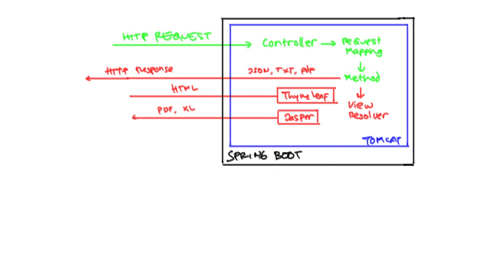

# Spring Boot #

Spring Boot adalah framework untuk memudahkan pembuatan aplikasi Spring Framework. Spring Boot tugasnya hanya memudahkan konfigurasi dan integrasi berbagai modul Spring dan library pihak ketiga.

Di antara modul Spring yang biasa digunakan dalam membuat aplikasi :

* Spring MVC
* Spring Security
* Spring Data JPA

Di antara library yang biasa digunakan dalam membuat aplikasi :

* Thymeleaf
* Hibernate
* Jasper Report

Dengan demikian, setelah konfigurasi berjalan baik, untuk menggunakan masing-masing modul Spring atau library, kita harus lihat dokumentasinya masing-masing, bukan di dokumentasi Spring Boot.

# Spring MVC #

Flow request yang melewati Spring MVC bisa dilihat pada gambar berikut

## Memasang Thymeleaf Layout ##

1. Tambahkan dependensi di `pom.xml`

        <dependency>
            <groupId>org.springframework.boot</groupId>
            <artifactId>spring-boot-starter-thymeleaf</artifactId>
        </dependency>

2. Buat class `@Controller`

        @Controller
        public class PesertaController {
    
            @RequestMapping("/peserta/registrasi/")
            public void registrasi(){}
        }

3. Buat template untuk layout dalam folder `src/main/resources/templates`

        <html lang="en" xmlns:layout="http://www.ultraq.net.nz/thymeleaf/layout">

        ....

            

            

        ....

        </html>

4. Buat page untuk screen aplikasi

        <html lang="en" xmlns:layout="http://www.ultraq.net.nz/thymeleaf/layout">

        ....
            
          

            <h1>Registrasi Peserta</h1>
          

        ....

        </html>

# Referensi #

* [Dokumentasi Spring Boot](http://docs.spring.io/spring-boot/docs/current/reference/html/)
* [Dokumentasi Spring MVC](http://docs.spring.io/spring/docs/current/spring-framework-reference/html/mvc.html)
* [Dokumentasi Thymeleaf](http://www.thymeleaf.org/documentation.html)
* [Dokumentasi Thymeleaf Layout Dialog](https://ultraq.github.io/thymeleaf-layout-dialect/)