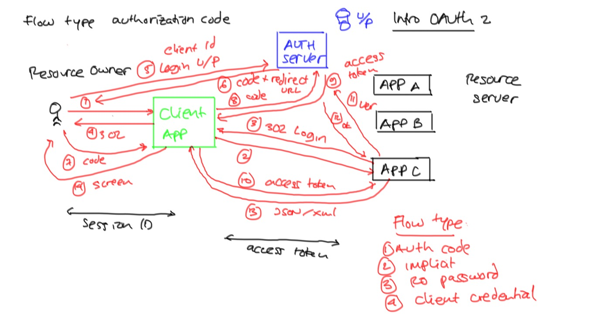
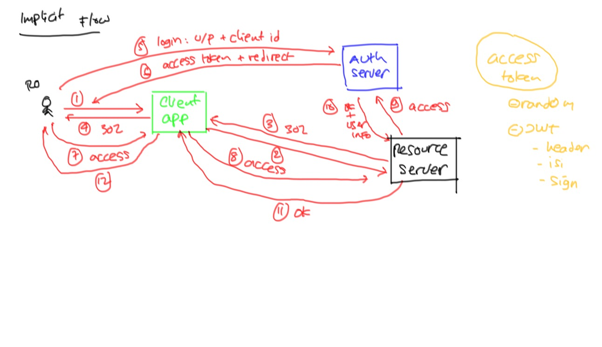
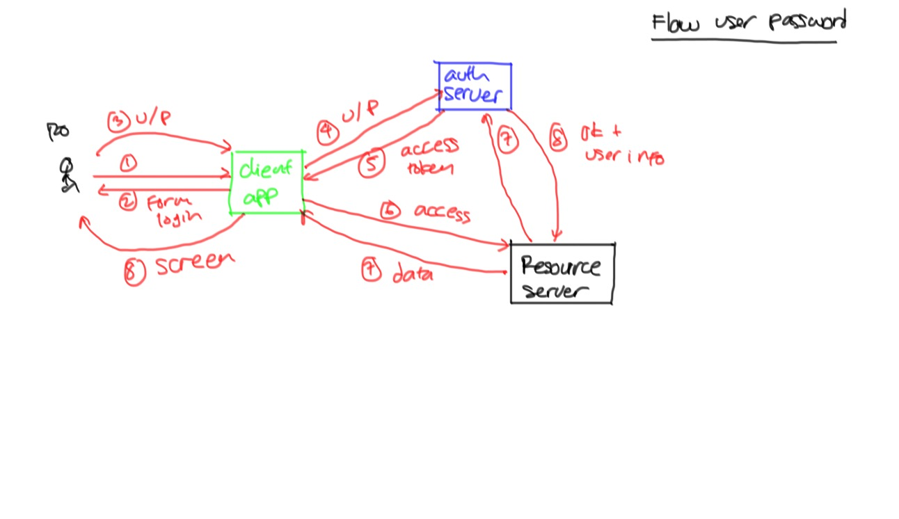
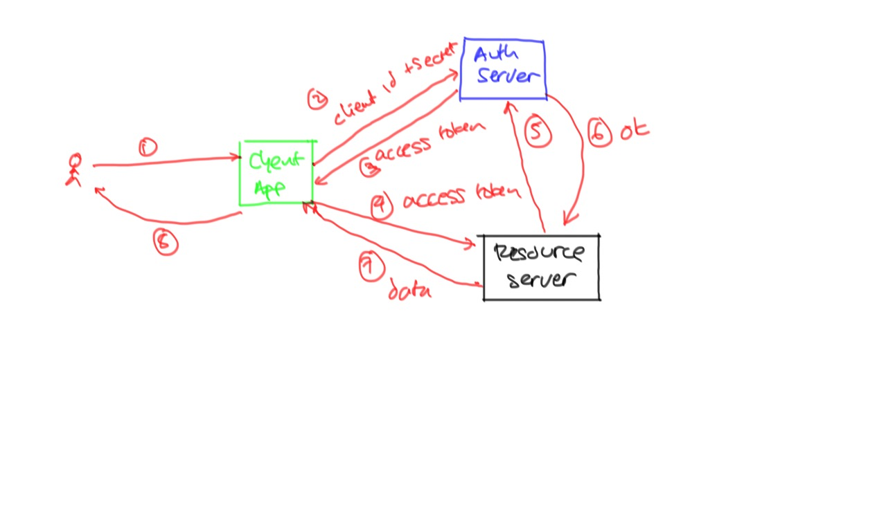

# OAuth 2.0 #

Beberapa istilah:

* Resource Owner
* Client Application
* Authorization Server
* Resource Server

## Cara Menggunakan Auth Server ##

Beberapa flow yang tersedia:

* Authorization Code : digunakan bila client app adalah aplikasi server side (Java, PHP, Ruby, Python, NodeJS, what have you) dan bisa menyimpan `client_secret` atau lazim juga disebut dengan istilah `API Key`. Bila aplikasi client menggunakan flow ini, kita bisa mengidentifikasi aplikasi mana saja yang mengakses aplikasi kita.
* Implicit : digunakan bila aplikasi client tidak bisa menyimpan `client_secret`. Biasanya karena aplikasinya berjalan di sisi user seperti misalnya aplikasi client-side JavaScript([Angular](https://angular.io), [Vue](https://vuejs.org/), [EmberJS](http://emberjs.com/), dsb).
* User Password : digunakan bila kita mengijinkan user untuk menginputkan username dan passwordnya di aplikasi client. Ini biasanya dilakukan bila aplikasi client kita juga yang membuat, seperti misalnya aplikasi Twitter, Facebook, dsb yang dibuat sendiri oleh Twitter, Facebook, dsb.
* Client Credential : digunakan untuk akses host to host antar aplikasi. Flow ini biasanya digunakan untuk fitur yang tidak spesifik ke user tertentu, misalnya trending topic di social media. Datanya global dan tidak terkait ke user tertentu.

Beberapa cara verifikasi token dari resource server ke authorization server:

* Lewat HTTP request.

### Authorization Code ###



* Mendapatkan auth code

        http://localhost:10000/auth/oauth/authorize?client_id=clientauthcode&response_type=code&redirect_uri=http://example.com

* Menukar auth code dengan access token. Misalnya auth code `wfLNoc`

        curl -X POST -vu clientauthcode:123456 http://localhost:10000/auth/oauth/token -H "Accept: application/json" -d "grant_type=authorization_code&code= wfLNoc&redirect_uri=http://example.com"

* Hasilnya seperti ini

   ```json
   {
        "access_token": "adfba26b-a38a-44fe-ab64-7039931de4a9",
        "token_type": "bearer",
        "refresh_token": "3a86bd39-fcf3-4191-af7c-aee8216b4def",
        "expires_in": 43199,
        "scope": "read write"
    }
   ```
* Token yang didapatkan bisa dicek detailnya ke auth server dengan perintah berikut

        curl -X POST -vu clientauthcode:123456 http://localhost:10000/oauth/check_token?token=adfba26b-a38a-44fe-ab64-7039931de4a9

* Hasilnya sebagai berikut

    ```json
    {
        "aud": ["aplikasitraining"],
        "exp": 1484184845,
        "user_name": "endy",
        "authorities": ["EDIT_KELAS", "EDIT_PESERTA", "VIEW_PESERTA", "VIEW_KELAS"],
        "client_id": "clientauthcode",
        "scope": ["read", "write"]
    }
    ```

### Implicit  ###



### User Password ###



### Client Credential ###


